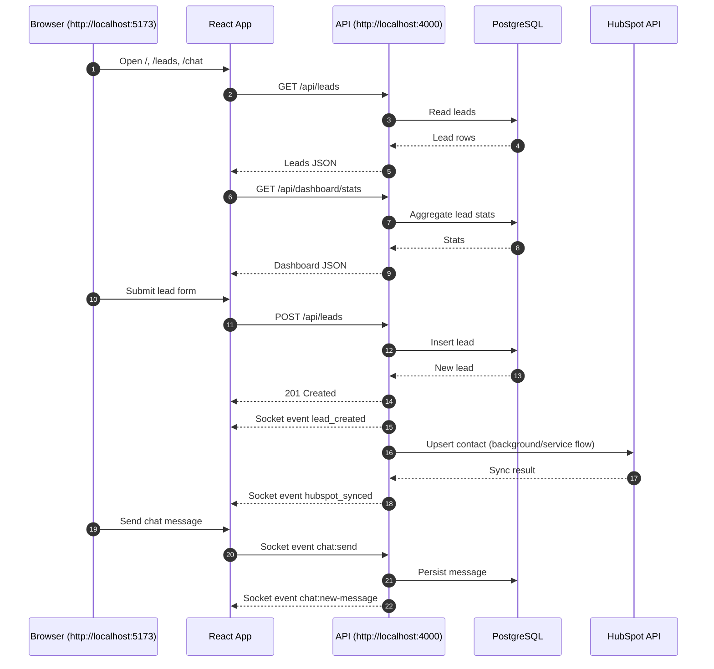

# Zone Task Flow and URLs

This document explains how the web app, API, database, and realtime layer connect in local development.

## Base URLs (Local)

- Web app: http://localhost:5173
- API server: http://localhost:4000
- API base used by web: http://localhost:4000/api
- Socket.IO server: http://localhost:4000
- Swagger UI: http://localhost:4000/api/docs
- Swagger JSON: http://localhost:4000/api/docs.json

## Frontend Routes

- Dashboard page: http://localhost:5173/
- Leads page: http://localhost:5173/leads
- Realtime chat page: http://localhost:5173/chat

## Backend HTTP Endpoints

### Health

- GET http://localhost:4000/health
  - Purpose: API liveness check.
  - Typical response: `{ "status": "ok" }`

### Leads

- GET http://localhost:4000/api/leads
  - Purpose: list all leads.
- POST http://localhost:4000/api/leads
  - Purpose: create a lead.
  - Expected JSON body:

```json
{
  "firstName": "John",
  "lastName": "Doe",
  "email": "john.doe@company.com",
  "company": "Company Inc",
  "budget": 25000
}
```

### Dashboard

- GET http://localhost:4000/api/dashboard/stats
  - Purpose: aggregate analytics for dashboard cards/table.

### HubSpot

- GET http://localhost:4000/api/hubspot/status
  - Purpose: check HubSpot integration health.
  - Note: returns 503 when HubSpot token is invalid/unreachable.

### Chat

- GET http://localhost:4000/api/chat/messages
  - Purpose: list chat messages.
- POST http://localhost:4000/api/chat/messages
  - Purpose: create chat message.

## Realtime Socket Events

- Socket endpoint: http://localhost:4000 (Socket.IO)
- Emitted by API:
  - `lead_created`
  - `hubspot_synced`
  - `chat:new-message`
- Received by API from client:
  - `chat:send`

## End-to-End Flow



## Environment Variables Used by URLs

- API side:
  - `API_PORT`
  - `API_ORIGIN`
- Web side:
  - `WEB_API_BASE_URL` or `VITE_WEB_API_BASE_URL`
  - `WEB_SOCKET_URL` or `VITE_WEB_SOCKET_URL`

## Quick Smoke Test URLs

- http://localhost:4000/health
- http://localhost:4000/api/leads
- http://localhost:4000/api/dashboard/stats
- http://localhost:4000/api/hubspot/status
- http://localhost:4000/api/docs
